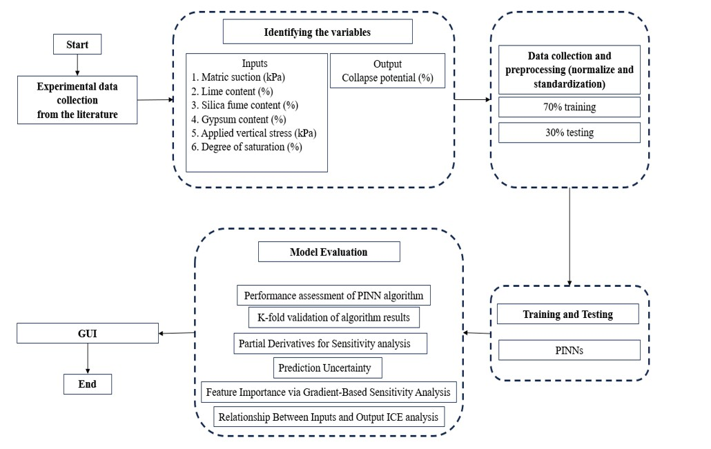

# EvoPINN: An Evolutionary Physics-Informed Neural Network Framework

EvoPINN is a hybrid machine learning framework that integrates **Physics-Informed Neural Networks (PINNs)** with traditional **Artificial Neural Networks (ANNs)** to model complex physical phenomena.We utlize it to Predict the Collapse Potential in Chemically Stabilized Unsaturated Gypseous Soils, while simultaneously embedding physical constraints into the learning process.

---

##  Overview

The EvoPINN framework is designed to:

- Leverage **PINNs** for optimizing neural network structures.
- Incorporate **Physics-Informed Neural Networks** to enforce known physical laws through custom loss functions.
- Uses **Artificial Neural Networks** to model relationships in datasets involving partial knowledge or observational data.
- Evaluated performance using standard regression metrics like **RMSE** and **R² Score**.

---

##  Features

- **Physics Neural Architecture Search (ENAS)** for PINNs
- Physics-based loss enforcement in training
- Scalable to both low- and high-dimensional regression problems
- Easy to integration with PyTorch and DEAP

---
## Piplines



## 📁 Directory Structure

~~~
├── data/
│   ├── cp.csv
│── Notebooks/ 
│   ├── Inference_pd_pinns_exp2_2ice_2.ipynb 
│   ├── pd_pinns_exp2_2ice_2.ipynb
│   ├── pd_pinns_exp2_2ice_2_draft_exp.ipynb
│   └── regression&gauss_markov_assumptions.ipynb
│── Inference_pd_pinns_exp2_2ice_2.ipynb 
│── pd_pinns_exp2_2ice_2.ipynb
│── pd_pinns_exp2_2ice_2_draft_exp.ipynb
│── regression&gauss_markov_assumptions.ipynb
~~~


---

## Dataset 
The collocted dataset are avaliable under `data/dataset.csv` dir., Please if want to use it cite it as mentioned below 

## Installation

```bash
pip install -r requirements.txt
torch
numpy
pandas
scikit-learn
matplotlib
seaborn
openpyxl
deap
```

## Usage
We can follow the instruction below to either train(for reproduce) or test(for usage or validate) 
or we can use Google Colab Notebook listed under `Notebooks` dir.
### Training
```
git clone https://github.com/Mohammed20201991/EvoPINN.git
cd EvoPINN
python pd_pinns_exp2_2ice_2.py --data "path/to/data"
```

### Testing
`
python Inference_pd_pinns_exp2_2ice_2.py --data "path/to/data"
`


## Results
```
##  Performance Metrics Comparison

| Metric | PINNs   | LR (OLS) | RL      | RR      |
|--------|---------|----------|---------|---------|
| RMSE   | 1.4109  | 9.9367   | 9.9367  | 10.0214 |
| R²     | 0.9896  | 0.609    | 0.609   | 0.603   |

Legend:
- PINNs: Physics-Informed Neural Networks  
- LR (OLS): Linear Regression (Ordinary Least Squares)  
- RL: Ridge Regression  
- RR: Regularized Regression

> 📈 Lower RMSE and higher R² indicate better model performance.

```
```
@misc{evopinn2025,
  title        = {Physics Informed Neural Network to Predict the Collapse Potential in Chemically Stabilized Unsaturated Gypseous Soils},
  author       = {Omar H. Jasim, Mohammed Al-Hitawi, Mohammed Y. Fattah, and Nameer A. Kareem},
  year         = {2025},
  publisher    = {GitHub},
  journal      = {GitHub Repository},
  email        = {omar.hamdi@uoanbar.edu.iq ,al_hitawe@uofallujah.edu.iq}
  howpublished = {\url{https://github.com/Mohammed20201991/EvoPINN}},
}
```
