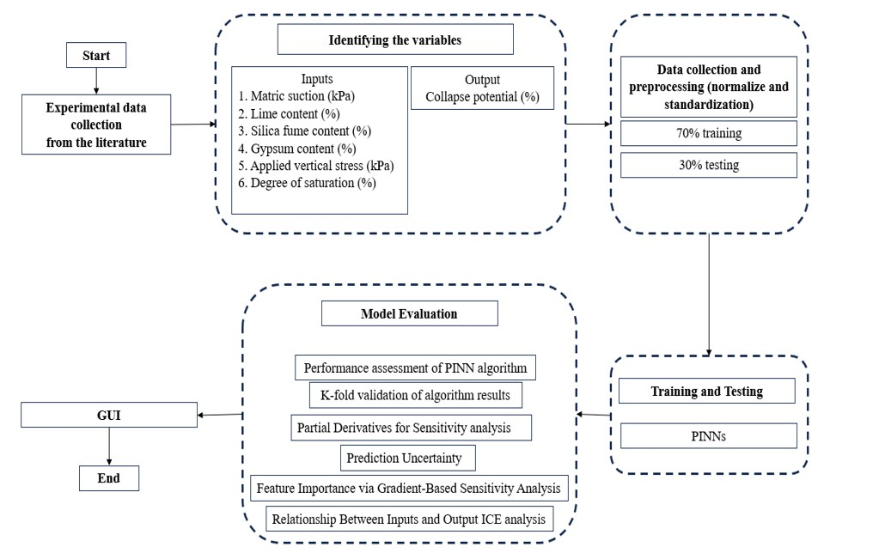

# EvoPINN: An Evolutionary Physics-Informed Neural Network Framework

EvoPINN is a hybrid machine learning framework that integrates **Physics-Informed Neural Networks (PINNs)** with traditional **Artificial Neural Networks (ANNs)** to model complex physical phenomena.We utlize it to Predict the Collapse Potential in Chemically Stabilized Unsaturated Gypseous Soils, while simultaneously embedding physical constraints into the learning process.

---

##  Overview

The EvoPINN framework is designed to:

- Leverage **PINNs** for optimizing neural network structures.
- Incorporate **Physics-Informed Neural Networks** to enforce known physical laws through custom loss functions.
- Uses **Artificial Neural Networks** to model relationships in datasets involving partial knowledge or observational data.
- Evaluated performance using standard regression metrics like **RMSE** and **R² Score**.

---

##  Features

- **Physics Neural Architecture Search (ENAS)** for PINNs
- Physics-based loss enforcement in training
- Scalable to both low- and high-dimensional regression problems
- Easy to integration with PyTorch and DEAP

---
## Piplines



## 📁 Directory Structure

~~~
├── data/
│   ├── cp.csv
│── Notebooks/ 
│   ├── Inference_pd_pinns_exp2_2ice_2.ipynb 
│   ├── pd_pinns_exp2_2ice_2.ipynb
│   ├── pd_pinns_exp2_2ice_2_draft_exp.ipynb
│   └── regression&gauss_markov_assumptions.ipynb
│── Inference_pd_pinns_exp2_2ice_2.ipynb 
│── pd_pinns_exp2_2ice_2.ipynb
│── pd_pinns_exp2_2ice_2_draft_exp.ipynb
│── regression&gauss_markov_assumptions.ipynb
~~~


---

## Dataset 
The collocted dataset are avaliable under `data/dataset.csv` dir., Please if want to use it cite it as mentioned below 

## Installation

```bash
pip install -r requirements.txt
torch
numpy
pandas
scikit-learn
matplotlib
seaborn
openpyxl
deap
```

## Usage
We can follow the instruction below to either train(for reproduce) or test(for usage or validate) 
or we can use Google Colab Notebook listed under `Notebooks` dir.
### Training
```
git clone https://github.com/Mohammed20201991/EvoPINN.git
cd EvoPINN
python pd_pinns_exp2_2ice_2.py --data "path/to/data"
```

### Testing
`
python Inference_pd_pinns_exp2_2ice_2.py --data "path/to/data"
`


## Results

##  Performance Metrics Comparison
The proposed Physics-Informed Neural Network (PINNs) significantly outperformed conventional statistical regression models in predicting the collapse potential of chemically stabilized unsaturated gypseous soils.

|      Metric      |   PINNs (Ours)  | LR (OLS) | Lasso Regression | Ridge Regression | Physics-Constrained Random Forest | MLPNN (Previous Study) | RBFN (Previous Study) |
| :--------------: | :-------------: | :------: | :--------------: | :--------------: | :-------------------------------: | :--------------------: | :-------------------: |
|     **RMSE**     |    **1.4109**   |  9.9367  |      9.9367      |      10.0214     |               3.8173              |        **1.119**       |         1.731         |
|      **R²**      |    **0.9896**   |   0.609  |       0.609      |       0.603      |               0.9098              |          0.904         |         0.841         |
| **Dataset Size** | **600 samples** |     -    |         -        |         -        |                 -                 |       766 samples      |      766 samples      |


Legend:
- PINNs: Physics-Informed Neural Networks  
- LR (OLS): Linear Regression (Ordinary Least Squares)  
- RL: Ridge Regression  
- RR: Regularized Regression

> 📈 Lower RMSE and higher R² indicate better model performance.


Key Findings

✅ PINNs achieved an R² of 0.9896, substantially outperforming all traditional regression models.<br>
✅ RMSE was reduced by over 85% compared with Linear, Lasso, and Ridge Regression.<br>
✅ The proposed approach achieved superior prediction accuracy while using 600 samples, demonstrating excellent generalization capability.<br>
📌 Although the previous MLPNN reported a slightly lower RMSE, our proposed PINNs framework provides physics-informed interpretability, improved robustness, and significantly higher explanatory power (R² = 0.9896).<br>

**Performance Interpretation**
- Lower RMSE indicates smaller prediction errors.
- Higher R² indicates better agreement between predicted and measured collapse potential.

Publication

🎉 This work has been accepted for publication in the Springer Nature journal:

Modeling Earth Systems and Environment

https://link.springer.com/journal/40808

Paper Title

Physics-Informed Neural Networks for Predicting Collapse Potential in Chemically Stabilized Unsaturated Gypseous Soils: Interpretable Machine Learning Framework

```
@article{AlHitawi2026PINNs,
  title   = {Physics-Informed Neural Networks for Predicting Collapse Potential in Chemically Stabilized Unsaturated Gypseous Soils: Interpretable Machine Learning Framework},
  author  = {Omer K. Jassim, Mohammed A.S. Al-Hitawi, et.al },
  journal = {Modeling Earth Systems and Environment},
  publisher = {Springer Nature},
  year    = {2026},
  note    = {Accepted for publication},
  url     = {https://link.springer.com/journal/40808}
}
```
```
@misc{evopinn2025,
  title        = {Physics-Informed Neural Networks for Predicting Collapse Potential in Chemically Stabilized Unsaturated Gypseous Soils: Interpretable Machine Learning Framework},
  author       = {Omer K. Jassim, Mohammed A.S. Al-Hitawi, et.al },
  year         = {2025},
  publisher    = {Springer Nature},
  journal      = {Modeling Earth Systems and Environment},
  email        = {al_hitawe@uofallujah.edu.iq}
  howpublished = {\url{https://github.com/Mohammed20201991/EvoPINN}},
}
```
